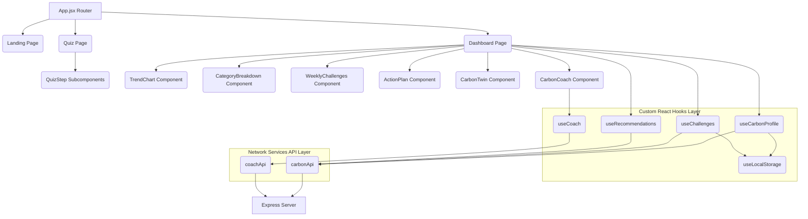

# System Architecture

This document describes the structural layout and system layers of the Verdant Pulse application.

## Frontend Design Layers

1. **Routing & Core Orchestration (`App.jsx`)**
   - Directs overall view state (`landing`, `quiz`, `dashboard`).
   - Hooks into the global state providers (`useCarbonProfile` and `useChallenges`).

2. **Presentation Components (`components/`)**
   - Clean rendering structures optimized with `React.memo` to eliminate redundant redraw operations.
   - Decoupled from service modules; consumes props directly.

3. **Custom Hooks (`hooks/`)**
   - Acts as the state machinery. Handles asynchronous data syncing, cache invalidation, and daily streaks counting.
   - Encapsulates side-effects securely.

4. **Service Adapters (`services/`)**
   - High-level abstractions wrapping fetch calls. No routing or component details are exposed here.

5. **Utilities & Constants (`utils/` / `constants/`)**
   - Pure math formulas (`calculations.js`), string helpers (`formatters.js`), and safe browser read/writes (`storage.js`).
   - Unified configurations (`ecoConstants.js`).
